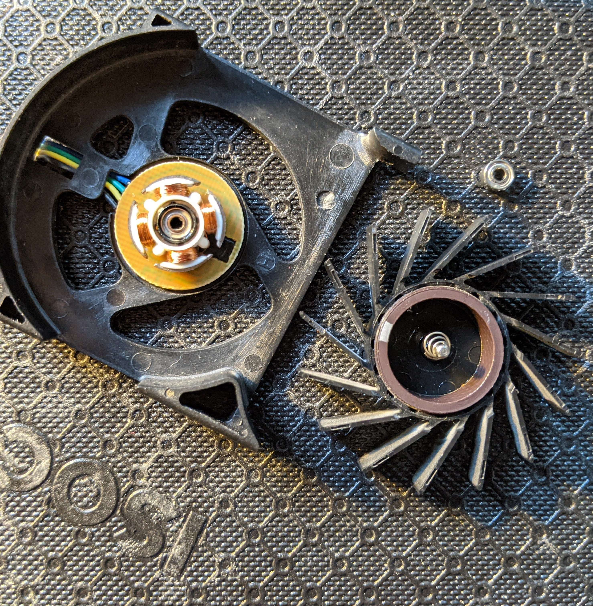
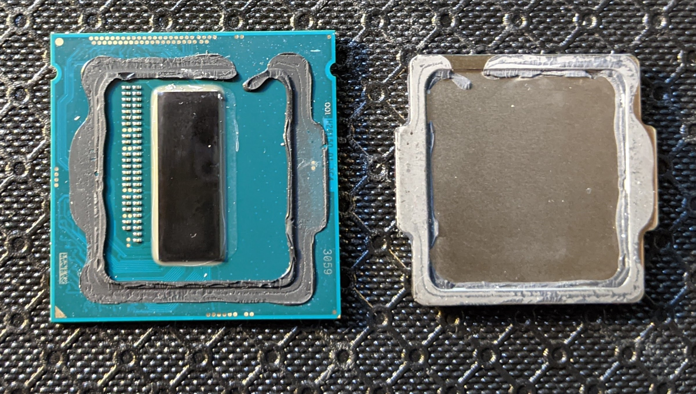
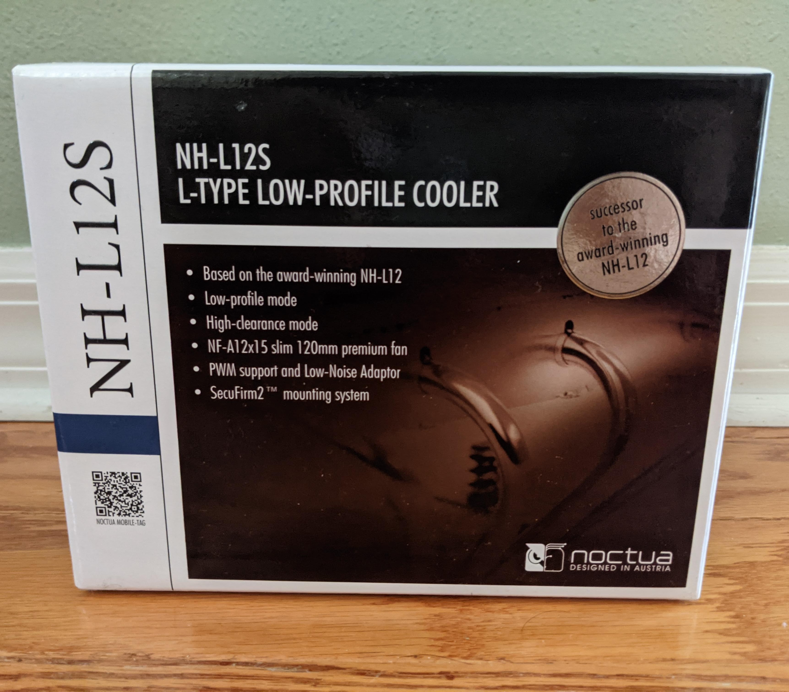
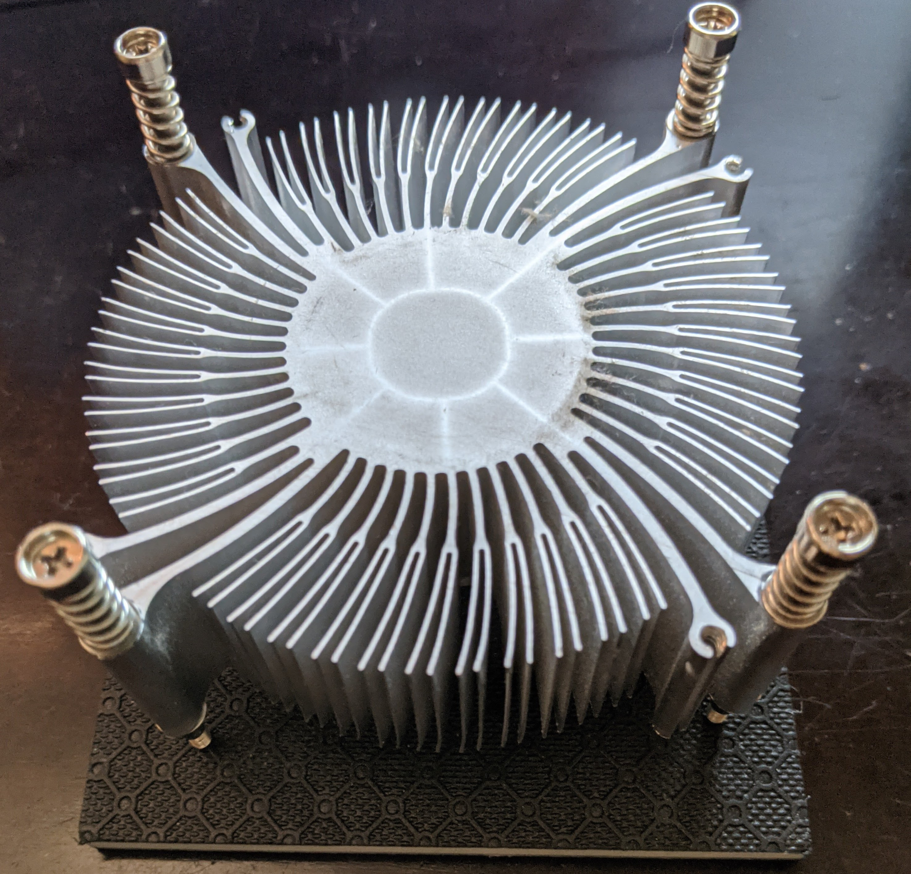
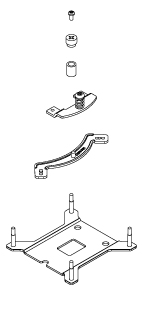
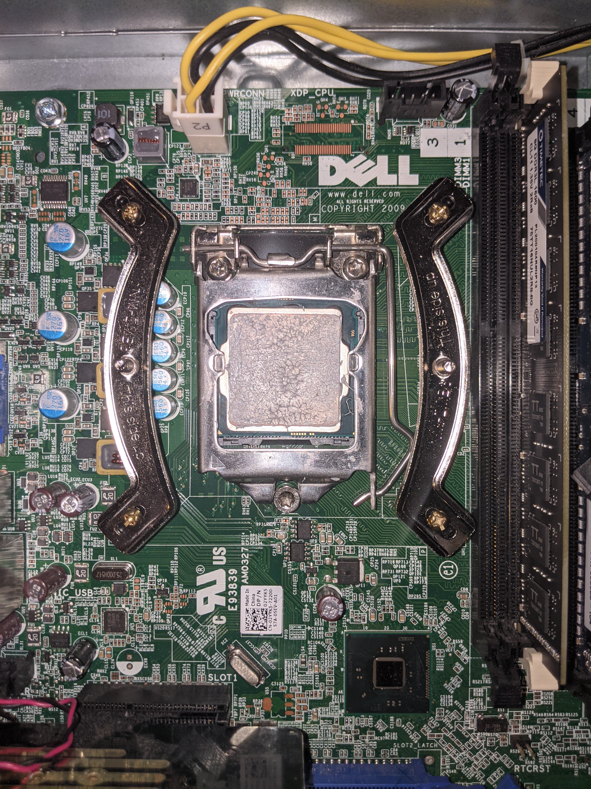
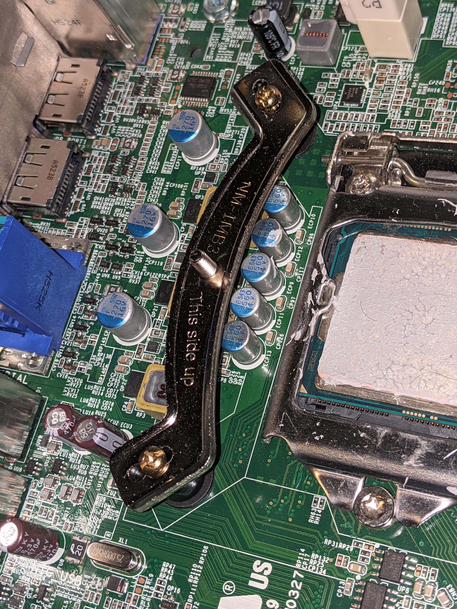
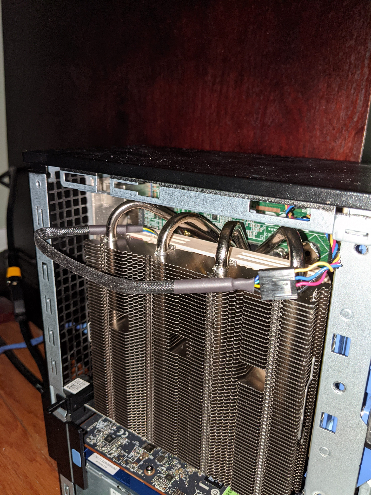

+++
title = "Upgrading my Dell Optiplex 7020"
date = 2020-12-11T06:15:00-05:00
+++

Back in February, I bought a Dell Optiplex 7020 SFF. It fits in a carry-on bag, but it's big enough that I've been able to install some much-needed upgrades.

##  GPU: [Radeon Pro WX 4100](https://www.amd.com/en/products/professional-graphics/radeon-pro-wx-4100)

Because the desktop is small form factor, I needed a GPU that's half height and low profile. It also couldn't have auxiliary power requirements since the [Dell PSU has proprietary connectors](https://www.dell.com/community/Optiplex-Desktops/Optiplex-3020-7020-9020-XE2-Dell-8pin-ATX-MB-pinout/td-p/7538164) and I didn't want to risk wiring it up incorrectly. The Radeon Pro WX 4100 is the newest GPU that meets all those requirements.

It fits in the PCIe x16 slot well. The blower fan intake is right next to the case fan, and there's enough space to add a second expansion card in the adjacent PCIe x4 slot. So far it's been great for lightweight/medium gaming ([CS:GO](https://en.wikipedia.org/wiki/Counter-Strike:_Global_Offensive), [Team Fortress 2](https://en.wikipedia.org/wiki/Team_Fortress_2), etc.). Supposedly, it can drive four 4K monitors at once.

### Noisy Fan

My only complaint is that the fan gets loud at high RPM. Though that's probably true to some extent for all cards with blower fans. On Linux I use [rocm-smi](https://github.com/RadeonOpenCompute/ROC-smi) to control fan speed and power usage:
```bash
# Drops power usage to 4W on average, which lets the fan run much more slowly.
# Warning is safe to ignore as the power budget is being *under* driven.
alias gpuquiet='rocm-smi --setpoweroverdrive 4 --setperflevel low --setfan 20'
# Reset everything back to driver control. I use this when playing games.
alias gpuauto='rocm-smi --resetpoweroverdrive --resetfans --setperflevel auto'
```
I have to stick it out on Windows since the Radeon Pro Software sets a pretty high minimum fan speed.

If I'm planning to use Windows for anything long-term, I need to stop the noise. At first I thought about replacing the `FirstD FD6010U12D` fan, but I can't be sure that others won't sound the same.
Now that I've [disassembled the fan](https://www.instructables.com/How-to-Repair-a-Computer-Fan/), it sounds like the [MR52ZZ bearings](https://www.nskbearingcatalogue.com/product/mr52zz-bearing/) keeping the fan shaft centered are to blame.



I've tested different lubricants on the bearings, running the fan with direct 5V from a [Digilent Analog Discovery 2](https://store.digilentinc.com/analog-discovery-2-100msps-usb-oscilloscope-logic-analyzer-and-variable-power-supply/).
I tried motor oil and mineral oil, but they only made things worse 😞.

My plan now is to replace the bearings with [igus iglide J sleeve bearings (JSM-0205-02)](https://www.igus.com/product/3). They have the same dimensions as MR52ZZ bearings and won't make any noise.


*igus GmbH*

##  [Samsung EVO 970 500GB](https://www.samsung.com/us/computing/memory-storage/solid-state-drives/ssd-970-evo-nvme-m2-500gb-mz-v7e500bw/)

Sluggishness on computers is often because hard drives (and SATA in general) have lower throughput and higher latency[^1]. Installing an NVMe drive is perhaps the *biggest* improvement I could make. They've only become generally available in the last few years, but older computers can still support them.

Most NVMe SSDs come in M.2 format. Older motherboards don't have an M.2 PCIe slot, so I used an [M.2 PCIe to PCIe x4 adapter](https://www.amazon.com/gp/product/B07ZQ15S43/) to install it.

### Booting workaround

One other gotcha is that BIOS for the Optiplex 7020 [does not support booting directly from NVMe storage](https://www.dell.com/community/Optiplex-Desktops/M-2-NVME-as-boot-drive-Optiplex-7020/td-p/7722595). I've come up with the following workaround:
1. Store the [EFI system partition](https://en.wikipedia.org/wiki/EFI_system_partition) (or [MBR](https://en.wikipedia.org/wiki/Master_boot_record)) on a SATA drive (SSD/HDD) or USB
1. If it isn't automatically detected, add your bootloader (for GRUB: `grubx64.efi`) to the boot options from the BIOS setup
1. Keep all the other partitions on the NVMe drive
    * Linux: make sure your partitions to mount are listed correctly in [`/etc/fstab`](https://wiki.archlinux.org/index.php/Fstab) and that the Linux [initramfs](https://en.wikipedia.org/wiki/Initial_ramdisk) is in the EFI partition. It'll work like a charm:
      ```
      # Static information about the filesystems.
      # See fstab(5) for details.

      # <file system> <dir> <type> <options> <dump> <pass>

      # Mounting the EFI partition at /boot so that the initramfs can be written
      # to it whenever Linux gets updated.
      # /dev/sda1
      UUID=SOME-UUID      	/boot     	vfat      	rw,relatime,fmask=0022,dmask=0022,codepage=437,iocharset=iso8859-1,shortname=mixed,utf8,errors=remount-ro	0 2


      # I keep a copy of the EFI partition in /dev/nvme0n1p1
      # so I can put the drive in a newer computer hassle-free.
      # Hence why this is partition 2.
      # /dev/nvme0n1p2
      UUID=SOME-UUID	/         	ext4      	rw,relatime	0 1

      ```
    * Windows: it's complicated and there's no easy solution
      * One way is to do a fresh install on an NVMe drive and copy the EFI partition over to the hard drive
        * Note: might need to [repair the bootloader afterwards](https://www.dell.com/support/article/en-us/sln300987/how-to-repair-the-efi-bootloader-on-a-gpt-hdd-for-windows-7-8-8-1-and-10-on-your-dell-pc?lang=en)
        * I tried installing on partition 3 of my NVMe drive but the installer just returned opaque errors
      * Ended up installing directly on my HDD and [adding it to grub via os-prober](https://wiki.archlinux.org/index.php/GRUB#MS_Windows)

Now it takes just a few seconds to load up Linux and start [sway](https://swaywm.org/)!

[^1]: There are other factors like memory bandwidth and single-core performance, but those pale in comparison when you look at user perceived latency

##  RAM: SK Hynix DDR3 1600 MHz

The desktop came with a single stick of 4GB RAM. I've since added another 4GB and an 8GB stick of SK Hynix RAM. The [spec sheet for the Optiplex 7020](https://i.dell.com/sites/csdocuments/Business_smb_merchandizing_Documents/en/us/Dell-OptiPlex-7020-Technical-Spec-Sheet-FINAL.pdf) claims the maximum usable memory is 16GB though the [processor can support up to 32GB](https://ark.intel.com/content/www/us/en/ark/products/80815/intel-core-i5-4590-processor-6m-cache-up-to-3-70-ghz.html). That's not a big deal, I can't imagine using more than 16GB with [zram](https://wiki.archlinux.org/index.php/Improving_performance#Zram_or_zswap) and [swap](https://wiki.archlinux.org/index.php/Swap) enabled.

##  CPU: [Intel i7-4790k](https://ark.intel.com/content/www/us/en/ark/products/80807/intel-core-i7-4790k-processor-8m-cache-up-to-4-40-ghz.html)

The [i5-4590](https://ark.intel.com/content/www/us/en/ark/products/80815/intel-core-i5-4590-processor-6m-cache-up-to-3-70-ghz.html) I had works well enough, but I wanted better single-thread performance. CPU-World's [great comparison table of LGA1150 processors](https://www.cpu-world.com/Sockets/Socket_1150_LGA1150_H3.html) helped me pick the i7-4790k:

||i5-4590|i7-4790k|
|--|--|--|
|Cores|4|4|
|Threads|4|8|
|Base Frequency|3.3 GHz|4.0 GHz|
|Turbo Frequency|3.7 GHz|4.4 GHz|
|L3 Cache|6MB|8MB|
|TDP|84W|88W|
|Hyper-Threading|No|Yes|
|Overclocking|No|Yes|

The [i7-5775C](https://ark.intel.com/content/www/us/en/ark/products/88040/intel-core-i7-5775c-processor-6m-cache-up-to-3-70-ghz.html) was an interesting option because of its [128MB eDRAM L4 cache](https://en.wikipedia.org/wiki/EDRAM). It seems that it's [useful for rendering](https://www.anandtech.com/show/16195/a-broadwell-retrospective-review-in-2020-is-edram-still-worth-it) and [Monero mining](https://github.com/fireice-uk/xmr-stak/blob/master/doc/tuning.md#choose-value-for-low_power_mode) but I'm doing neither.

### Thermal issues

After purchasing and installing my i7-4790k, CPU temperatures were off the charts. Loading more than one core with processes skyrocketed temps to nearly 100&deg;C. The case and cooler fans would spin at max RPM trying to bring it under control.

It took a few weeks to go through all the steps, but I have managed to get sub-60&deg;C temperatures under full load.

The first thing I did was to delid the CPU. These 4th generation chips are old enough that the [TIM](https://en.wikipedia.org/wiki/Thermal_interface_material) between the integrated heat spreader (IHS) and the die is worth replacing. It's a bit scary to think about removing something so well-adhered, and there's a chance of breaking the chip. Most guides recommend using a delidding kit, but I used the more crude bench vise method. I tried it out on my old CPU first to get some practice:

1. Position the CPU between the jaws so that IHS touches the inner jaw and the PCB touches the outer jaw 
*Atila Gobor, ekwb.com*

1. Double-check the placement. You don't want to be crushing the PCB in half!
2. Start closing the jaws. This applies force almost parallel to the IHS and chip. A delidding kit does the same thing but with fully-parallel force.
3. The outer jaw will shift suddenly, stop immediately.
4. Remove the CPU. The IHS should be free from the PCB. 

I didn't see any better performance after pasting and reinstalling the CPU. Then I realized I'd missed a crucial step: removing the old adhesive.


*Atila Gobor, ekwb.com*

The adhesive must be fully removed to achieve better contact between the processor die and IHS. Some guides will use a razor blade for this but that can damage the PCB traces and nick the IHS. You might even lose a transistor or two. Scraping it off with a fingernail worked just fine.

One other thing I got wrong was how much thermal paste to use. It felt a bit silly to read a [guide about thermal paste application](https://www.intel.com/content/www/us/en/gaming/resources/how-to-apply-thermal-paste.html), but it turned out I've always applied slightly too much. The paste should be just enough to achieve high contact. Too much will create a layer that reduces thermal conductivity. So less can be better.

After this, CPU temperature under load went down slightly. But the stock cooler still couldn't keep up.

##  CPU Cooler: [Noctua NH-L12S](https://noctua.at/en/nh-l12s)

This was my most dubious and ambitious upgrade. I wanted to get a Noctua cooler since they are well-reputed for whisper-quiet fans. The smallest cooler [officially compatible with that CPU](https://noctua.at/en/cpu/Intel_Core_i7-4790K) was the NH-L12S, which would barely fit in the case. YouTube user The_Chad uploaded a video [showcasing their Optiplex SFF upgrade](https://www.youtube.com/watch?v=rTILMvzbFnc) with a Noctua L9x65 and i7-4790. This convinced me that it was doable and I ordered the cooler.



### Mounting

I realized I'd made a big miscalculation after unboxing the Noctua cooler. The stock cooler doesn't use a standard mounting system. Four long screws screw into threaded standoffs on a metal panel behind the motherboard.



The standoffs are welded and can't be removed. The new cooler has a different mounting system:


*www.noctua.at*


There's a backplate with four threaded poles that is supposed to fit behind the motherboard. This works for most desktop cases, but it couldn't fit mine because of standoffs. In [The_Chad's video](https://www.youtube.com/watch?v=rTILMvzbFnc), they explained that screws from the AMD mounting kit could be used to forcibly adhere the cooler mounting brackets onto the standoffs, stripping the threads. I didn't want to do that just in case I had to revert to the stock cooler. At this point I was planning on returning the Noctua cooler. The last thing I tried was finding screws around the house that might fit the standoffs. I searched a jar of miscellaneous screws (the one that everyone has) and by pure chance, found four screws that fit perfectly. They're just M3 x 18MM screws that you can get from a local hardware store. *As far as I've read, this isn't publicly documented anywhere else.*


*Please ignore the excessive thermal paste 😅*

Then I installed the cooler. It's a tight fit:



It's also worth mentioning that Dell uses its own fan cable connector and color coding scheme. There are converter cables, but I just cut the cable off the old cooler fan, stripped the wires, and plugged them into the Noctua connector. Here's how the colors map:

|Purpose|Dell|Standard|
|--|--|--|
|GND|Black|Black|
|12V|Red|Yellow|
|Tachometer (RPM Sense)|Yellow|Green|
|PWM (RPM Control)|Blue|Blue|

I had to remove a few things to fit it in the case, but they weren't that important:

* Side panel trigger
  * Too large for the panel to close with the heatsink since it's so tall
  * Unscrewed the cover and popped off the mechanism
* CD drive:
  * The blue tab on the drive extends over and onto the cooler area
  * Didn't want to snap the tab off so I've temporarily removed the drive
* Case close mechanism
  * The CPU heatpipes prevent the case from opening and closing properly
    * I tried all four positions, but there wasn't room for it to close/open
  * Removed it by pushing in the mechanism from the locking tab on the back of the case, pushing in the plastic tab holding the mechanism in the metal railing, and then unhooking the spring
    * This means the case can't be locked shut, but I can still close the side panel and hold it shut with a sliver of tape

With this cooler installed, the hottest my CPU's gotten is 62&deg;C under full load for a few hours.
I'm still figuring out airflow but it seems fine so far with the side panel on.

## What's next?

I've fit in almost all the upgrades possible. The only thing left is to eliminate noise coming from the fans. The CPU cooler fan is already whisper quiet, and I've replaced the case fan with an [NF-A8 PWM](https://noctua.at/en/nf-a8-pwm/specification). I'm waiting on the iglide bearings to quiet down the [noisy gpu fan](#noisy-fan). I haven't looked into replacing the PSU or NVMe adapter card fans yet. Stay tuned!