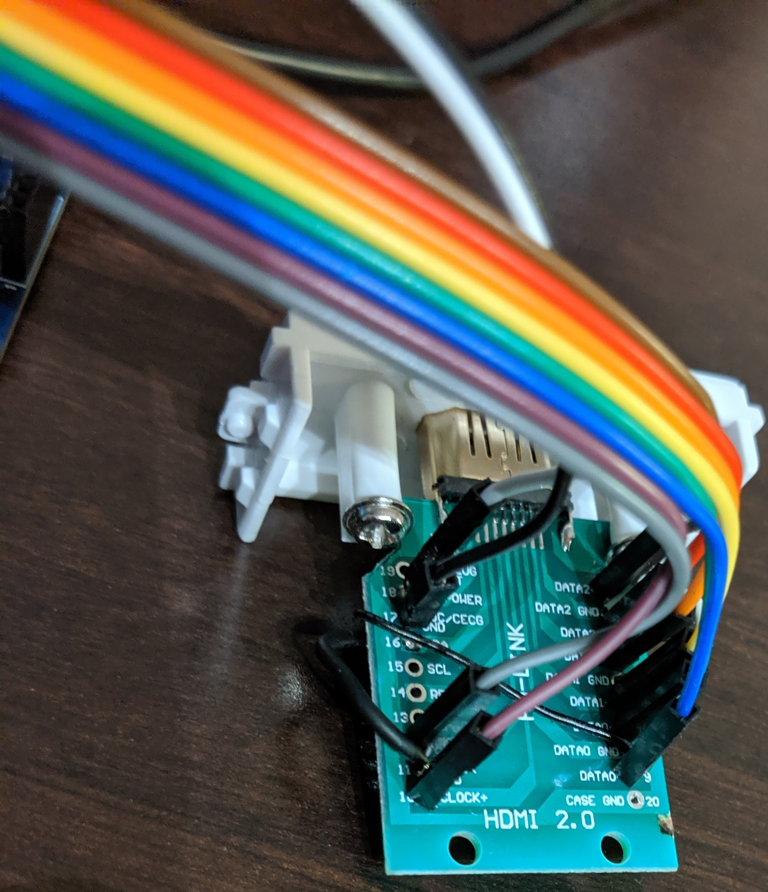
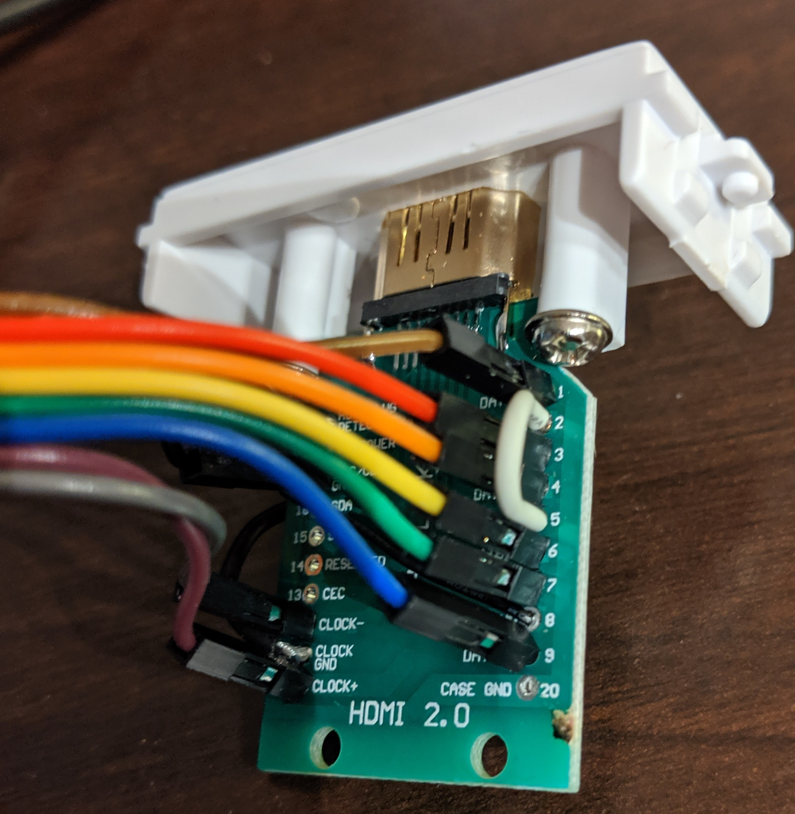
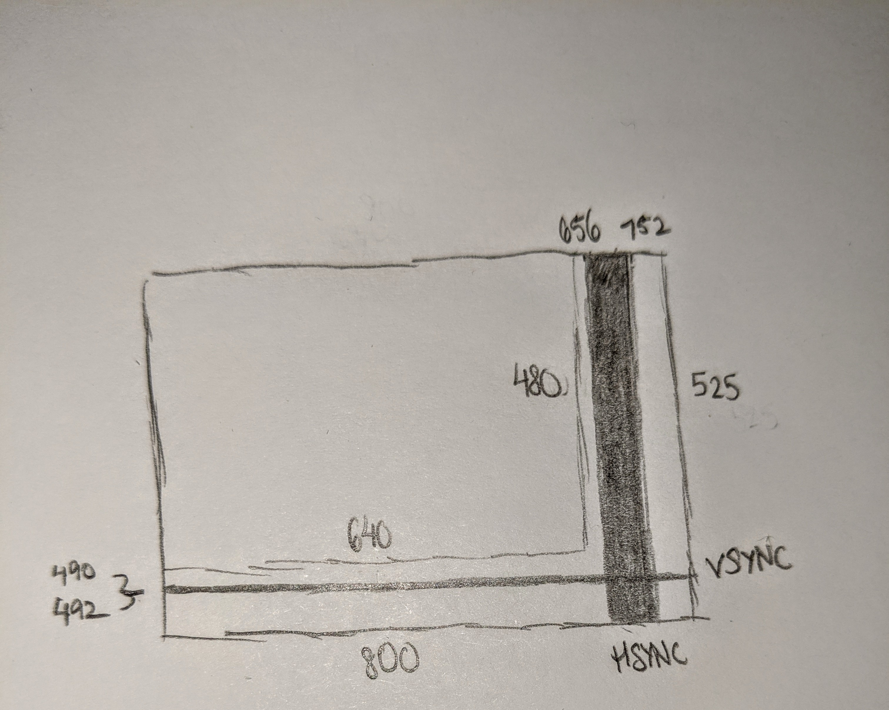
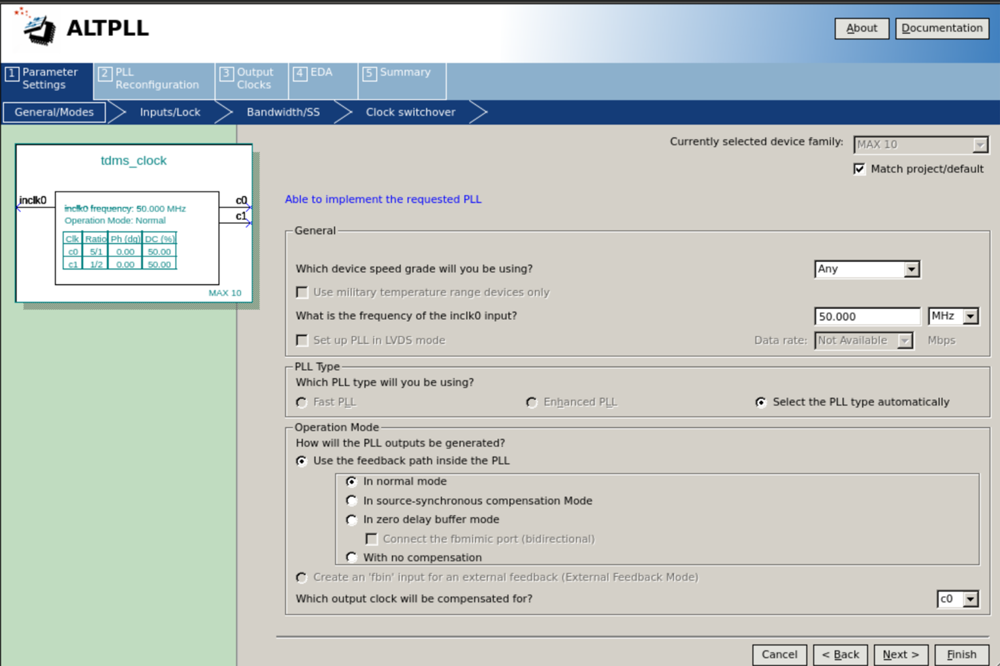
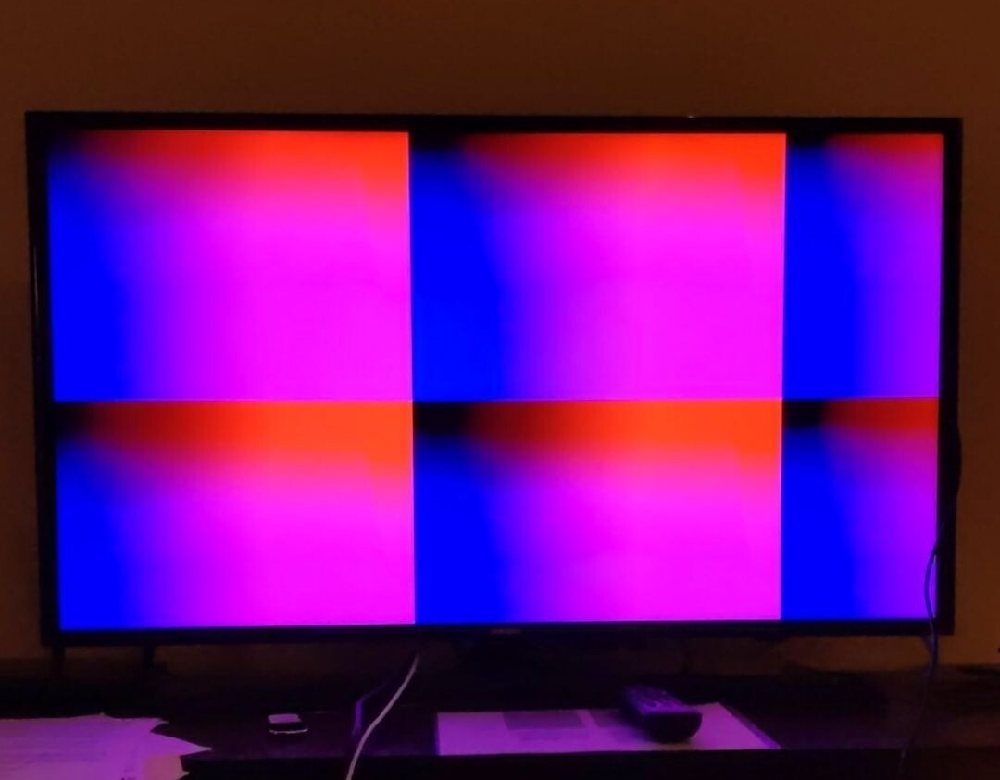
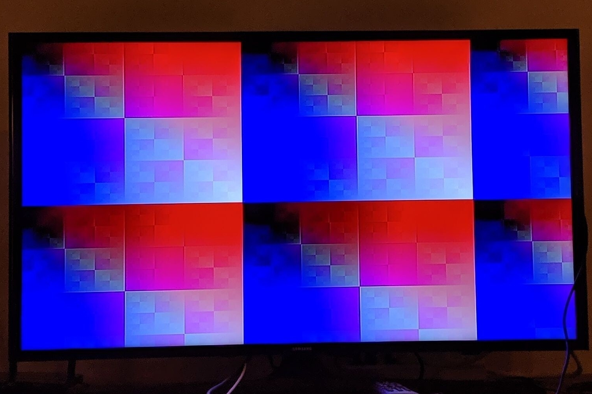
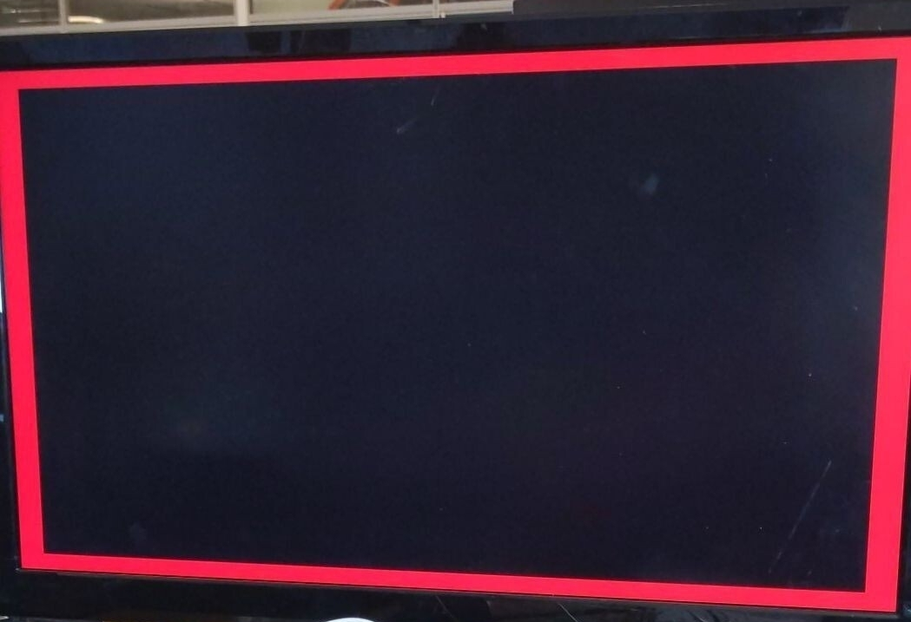
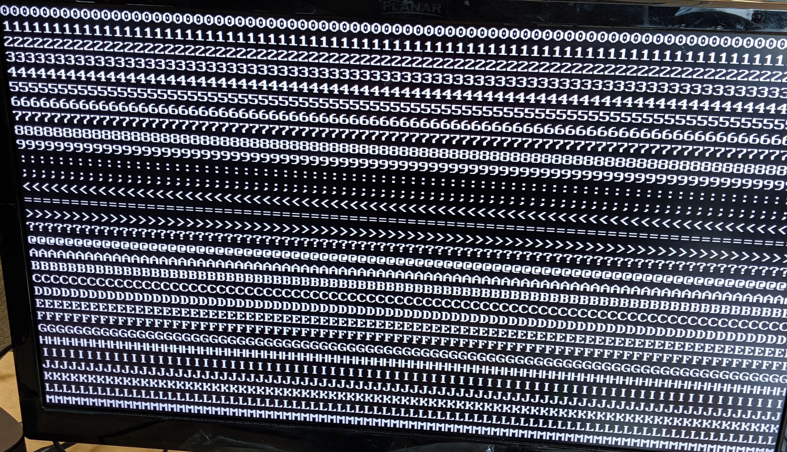

+++
title = "HDMI output on an FPGA"
date = 2019-07-18T19:11:13-07:00
description = "How I tackled HDMI output from the ground up as my first major FPGA development project."
+++

## Introduction

Back in my first year of university I took a course on digital logic. The homework was tedious as you might expect: doing boolean arithmetic by hand, drawing state machine diagrams, using Karnaugh maps, etc. The weekly lab group projects turned out to be pretty cool though. We built circuits with a drag and drop tool in Quartus, verified them with ModelSim, and ran them on an Altera DE FPGA development board. There were some components we never got to using like VGA output. 

Thinking I could do some cool projects, I bought an [FPGA board from Kickstarter](https://www.kickstarter.com/projects/201461162/maxprologic-ultra-low-cost-fpga-development-board/faqs) on a whim. It's been gathering dust for some time now so I set my mind to trying to build a little video display project. There were some interesting posts on hackaday like one where [Wenting Zhang uses an FPGA to display realtime ASCII art](https://hackaday.io/project/66319-realtime-vga-ascii-art-converter/), but I was nowhere near that level.

I first needed to switch from using block diagrams in Quartus to using a hardware description language. We briefly discussed VHDL in my digital logic class, so I wrote a few lines of VHDL to blink the board's LEDs as a hello world. I had trouble declaring sequential logic in VHDL and switched to Verilog HDL since the board's developer had an example in it. I went through [Deepak's Verilog tutorial on asic-world.com](http://www.asic-world.com/verilog/veritut.html) and tried a few blinking patterns like this strobing effect:

<video controls src="blinky.mp4"></video>

I set my sights on a simpler yet equally daunting project: *outputting video over HDMI*.

## No HDMI output? No problem.

My past self made the unfortunate oversight of getting an FPGA board without an HDMI port, so I needed to buy an HDMI breakout board. Adafruit only had the PCB version in stock at the time so I also bought some soldering equipment.

### Amazon
* Hakko FX-901 cordless soldering iron $28.50
* Eneloop batteries with charger $17.99
* Lead-free rosin core solder $9.59
* Lead-free tip tinner $6.50

Total: $62.58

### Adafruit
* 20 Male-Male jumper wires $1.95
* 20 Female-Male jumper wires $1.95
* Panel mount HDMI socket breakout $3.50

Total: $7.40

The Amazon order took only a day to arrive. The Adafruit order took a bit longer.

The goods, excluding the HDMI breakout which had already been soldered:

I bought the Hakko battery powered soldering iron since it's compact enough to take in checked luggage on a flight. It also gives off some jumbo vape pen vibes.

## Soldering

[Fpga4fun's guide on outputting video over HDMI](https://www.fpga4fun.com/HDMI.html) suggested that only the TMDS +/- data and pixel clock wires were absolutely necessary, so I only soldered those to save on jumper cables (ignore the bits of wire, black & white jumpers for now):

## Requirements

I chose the low-pixel format 640x480p @ 60HZ since [DVI 1.0 specification section 2.2.4.1](https://www.fpga4fun.comdvi_spec-V1_0.pdf) indicates it should be supported on most if not all displays. Plus, it's big enough for wide-360p video playback.

### Pixel clock

Outputting the low-pixel format actually requires some extra room so a larger 800x525 frame is needed:

The extra room on the right is the vertical blanking interval. The extra room on the bottom is the horizontal blanking interval. These historically allotted time for the electron beam in a CRT display to reposition itself. Now, they are used for synchronization pulses (shaded in the picture above) and for sending other data like audio.

HDMI needs a pixel clock fast enough to fit 60 of these frames into a single second: `800*525 pixels/frame * 60 frames/second = 25,200,000 pixels/second (Hz) = 25.2 MHz`. It's easier to produce a 25MHz clock since I have a 50MHz clock that I can just divide by 2. The frame rate will technically be 59.52Hz but that should still work.

### TMDS Clock

HDMI has three channels for sending data. For 24-bit RGB video, each sends 8 bits of one color. Sending color for each pixel thus requires a clock 8 times as fast as the pixel clock. Because an 8 to 10 bit encoding called TMDS is used, it actually needs to be 10 times as fast at 250MHz. Making a clock faster than on-board oscillators was not immediately obvious.

#### Phase-locked loop (PLL)

I discovored [PLLs](https://en.wikipedia.org/wiki/Phase-locked_loop) by chance while perusing my board's user manual. At a high level, they can multiply or divide input clocks by an integer. Altera has a PLL [IP block](https://en.wikipedia.org/wiki/Semiconductor_intellectual_property_core) which I used to create 25MHz and 250MHz clocks:

### What is TMDS?

TMDS itself is pretty interesting, let's break it down.

*Transition Minimized* refers to the encoding used. In the first stage, 8 bits are mapped to 9 to reduce the number of flips between 0 and 1. In the second stage, 9 bits are mapped to 10 to make the number of 0s and 1s equal on average ([DC balancing](https://en.wikipedia.org/wiki/DC_bias#Communications_systems)).

*Differential Signaling* refers to how the 10 bits are transmitted. A positive and negative version of the signal is sent on a twisted pair of copper wiring in the HDMI cable. The receiver can filter out common electromagnetic interference since the signals should be exact opposites of one another and any noise will perturb them roughly the same.

Writing a TMDS encoder from scratch would take time. Thankfully, Jean P. Nicolle from Fpga4fun.com provides [a video TMDS encoder](https://www.fpga4fun.comHDMI_test.zip) which works great.

## Implementation in Verilog

I wrote the top-level entity and other components from scratch and eventually switched over to my own TMDS encoder based on the HDMI 1.3a specification. I'll update this post once I release the code.

## Troubleshooting

As expected, output didn't work on the first try. It took a couple weeks to go through all the troubleshooting steps.

### Implementation level

I tried running Jean's full HDMI example exactly as given but it made no difference. Running a test bench in ModelSim showed that the outputs were correct.

### Physical level

I checked the pin assignments in Quartus and they matched up with the jumpers plugged into the FPGA board and the names on the breakout board. The other possibility was that more wires were required. Only 8 of the 20 possible pins on the HDMI breakout board were soldered. I found a random [Arduino HDMI shield schematic](https://cdn.alchitry.com/emb/hdmi-shield/hdmi-shield.pdf) and it had 18/20 pins connected. The DDC SCL/SDA lines are for optional higher level control and hot plug detection is not required. I connected the shield pins to ground and the 5V pin to 5V on my FPGA board, hence all the random bits of wire in the picture of my soldered HDMI board from earlier.

### Signal level

I didn't have an oscilloscope to check the actual signal so pretty much anything could've be wrong with it.

Differential signals flew over my head in the first implementation where negative channels were just assigned the TMDS signals negated. Instead, I needed to assign the TMDS IO standard to the output channels and use a true differential buffer on the signal.

The MAX 10 FPGA only supports TMDS as an IO input standard so it can't even send HDMI compliant signals. This was pretty discouranging but I was already pretty invested in this project. A couple hours searching through forums led me to [Mike Field's DVI test](http://hamsterworks.co.nz/mediawiki/index.php/Dvid_test) which notes that **specifying the LVDS IO standard instead will still work for some lower resolutions**. MAX 10 luckily supports LVDS output.

I couldn't find any good documentation on why TMDS and LVDS might be compatible. TMDS is current-mode logic and LVDS is something else. I've come to accept that there's some magical range of overlap between the two at low speeds. 

A few places discuss converting between the two. I leave further investigation up to you and/or my future self: https://m.eet.com/media/1135468/330072.pdf, https://www.ti.com/lit/an/scaa059c/scaa059c.pdf, https://www.silabs.com/documents/public/application-notes/AN408.pdf, https://github.com/mattvenn/kicad/tree/master/dvi-pmod, https://electronics.stackexchange.com/questions/130942/transmitting-hdmi-dvi-over-an-fpga-with-no-support-for-tmds, https://hackaday.io/page/5702-dvi-hdmi-pmod-for-an-ice40-fpga.

## Success!

After all this troubleshooting, something finally popped up:

### Overscan

Overscan is a feature that crops the image and stretches it to fit the screen.

The red border on my monitor below is cut off on my TV:

Old CRT TVs had unreliable image scaling and positioning so TV stations designated a safe display area. Some took advantage of this and started sending other data in these regions. Even though modern TVs don't need this compensation, they keep it enabled by default so that it doesn't display. Samsung TVs only let you disable it on 16:9 resolutions unfortunately.

## Future work

There's a lot of extensions to this project worth pursuing:

### Text output

Being able to display text makes for easier debugging so I'm implementing [VGA-compatible text mode](https://en.wikipedia.org/wiki/VGA-compatible_text_mode):

### Audio

HDMI also lets you send audio when video isn't being output. The HDMI version 1.3a specification is available for free from [hdmi.org](https://www.hdmi.org/manufacturer/specification.aspx) and explains data island packet construction for L-PCM audio.

There are also some cool projects that directly produce audio signals over an audio jack. [Fpga4fun.com has one on PWM with a 1-bit DAC](https://www.fpga4fun.com/PWM_DAC_3.html).

### User input

The easiest interface to connect seems to be PS/2 but a PS/2 keyboard is hard to come by. Some older USB keyboards unofficially support fallback to PS/2 over USB. This can be used by treating a USB port as a PS/2 port using the [USB to PS/2 adapter pinout on pinouts.ru](https://pinouts.ru/InputCables/usb_ps2_mouse_pinout.shtml).

I was also browsing Adafruit for other components to get and bought a nifty NXP-9 breakout board. It combines an accelerometer, magnetometer, and gyroscope into one package and could be used to build gesture-based user input.

### Soft CPU

Rust has basic support for some Risc-V ISA extensions (I, M, C). The ISA looks a bit daunting so it is on the back burner for now.
