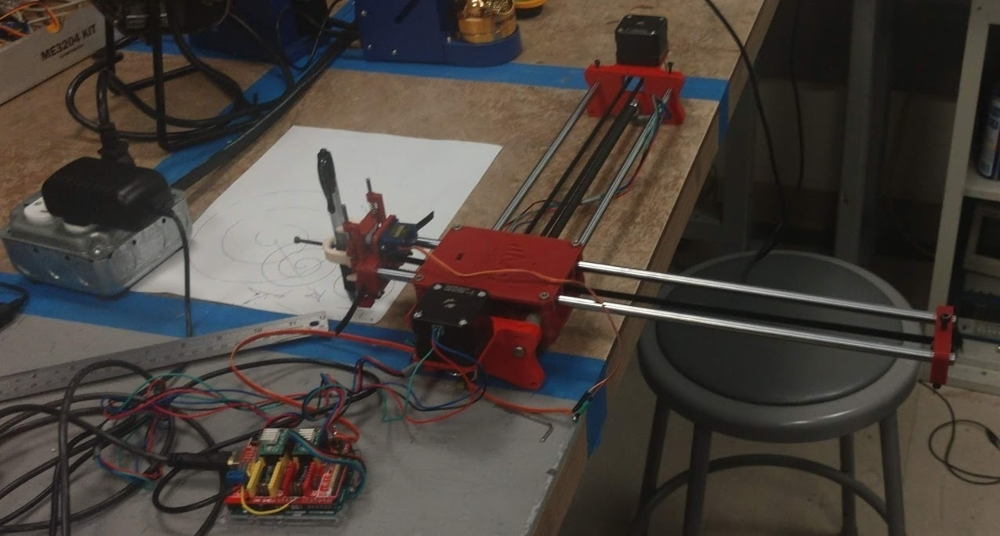
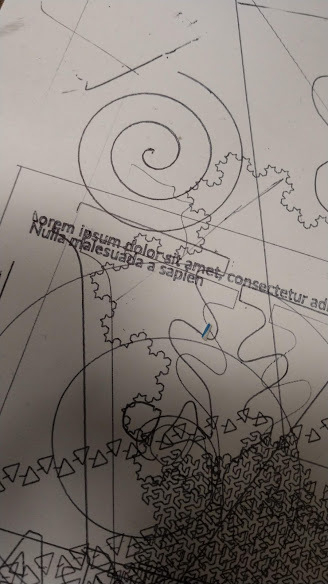
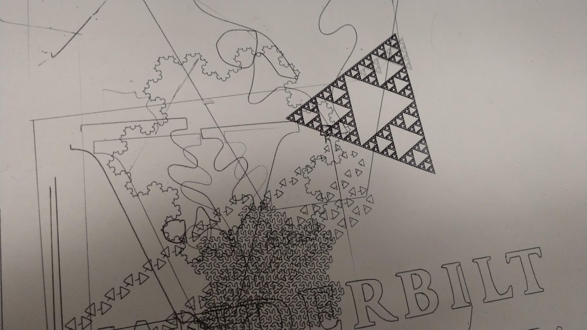
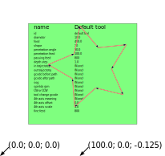

+++
title = "Pen Plotter"
date = 2019-05-13T16:38:58-04:00
description = "How I helped build a pen plotter from a design on Thingiverse and wrote svg2gcode to draw SVGs with it."
[taxonomies]
tags = ["hardware"]
+++

Plotters are a type of printer for drawing vector graphics that emerged in the early 1960s. There are many types, the most common being the pen plotter which draws on paper with a pen. Known for their high quality, they are used for printing technical drawings like blueprints or isometric views of CAD models. However, improvements in raster-based printing (i.e. laser, inkjet printers) like higher resolution and larger formats have made plotters largely obsolete. Some are still used in unconventional situations like drawing on media that cannot be bent (i.e. packages, CDs) and cutting vinyl stickers.

For a group project in the Spring 2019 semester, I helped build one following [Henry Arnold's Drawing Robot page on Thingiverse](https://www.thingiverse.com/thing:2349232). The parts cost $138.92 [^1] and took our team of three 20 hours to assemble.

The two large stepper motors (black cubes) are connected via a single timing belt, using the [CoreXY technique](https://corexy.com/theory.html) to move the print head. A small stepper motor (blue, next to pen) on the print head lowers or raises the pen. An Arduino Uno loaded with the [GRBL CNC firmware](https://github.com/gnea/grbl/) controls plotter motion. A laptop (not pictured) is used by the end user to send [GCode instructions](https://en.wikipedia.org/wiki/G-code) using [Universal G-Code Sender](https://github.com/winder/Universal-G-Code-Sender) to the Arduino telling it where to move the print head. Below are a few samples of the page the pen plotter drew on, showing its precision.

I originally used the [GCodeTools](https://github.com/cnc-club/gcodetools) extension that comes with Inkscape to convert vector graphics into the GCode instructions for the plotter but found it to be unwieldy. The extension was primarily made for CNC milling machines which have a z-axis and many settings that are unrelated to pen plotters. Every time you want to convert an SVG, you have to reconfigure settings in a tool dialog that pops up and covers your image:

To make printing things easier, I wrote [svg2gcode](https://github.com/sameer/svg2gcode), which converts SVGs to GCode for a pen plotter[^2]. SVG paths (bezier curves, lines, elliptical curves, etc.) and other important elements like rotations are transformed into an intermediate turtle graphics representation and then converted into GCode instructions. I used this in combination with work mentioned in my [Lindenmayer systems post](Lindenmayer Systems) to draw the Sierpinski Triangle, Koch Snowflake, and gosper seen above.

Building the pen plotter was a pretty cool project and has given me much insight into related areas like SVG DOM, path tolerances, and 3D printing.

[^1]: They were ordered from Amazon due to a 2-week time constraint. Some like the Arduino CNC shield would have been much cheaper to purchase from other sources. Free 3D printing provided by [The Vanderbilt Design Studio](https://vanderbilt.design) is excluded.

[^2]: It took me almost 40 hours to write and debug it and I doubt our pen plotter will ever even see that much use.
