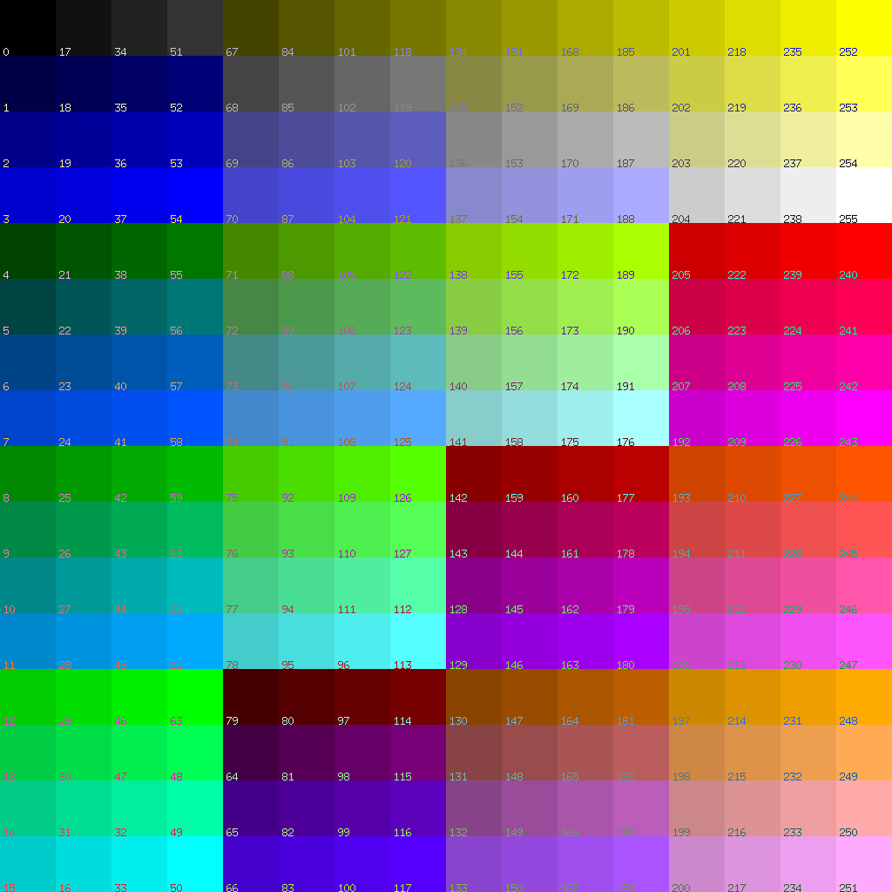

+++
title = "2D Rendering of the Plan 9 Palette Cube"
date = 2018-12-29T20:25:54-05:00
+++

I couldn't find a good, public domain image that shows what the Plan 9 palette should look like, so I decided to create one.

The GoLang code used to generate the image below is [available as a gist](https://gist.github.com/sameer/7c27ae1985deea0088c86cc13cc88bb1).

As described by the GoLang Plan9 palette documentation:

> Plan9 is a 256-color palette that partitions the 24-bit RGB space into 4×4×4 subdivision, with 4 shades in each subcube. Compared to the WebSafe, the idea is to reduce the color resolution by dicing the color cube into fewer cells, and to use the extra space to increase the intensity resolution. This results in 16 gray shades (4 gray subcubes with 4 samples in each), 13 shades of each primary and secondary color (3 subcubes with 4 samples plus black) and a reasonable selection of colors covering the rest of the color cube. The advantage is better representation of continuous tones.

