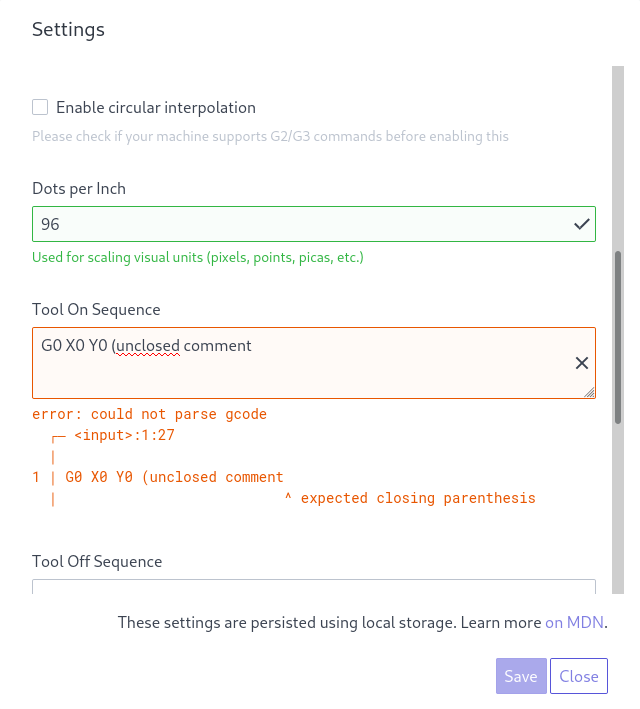
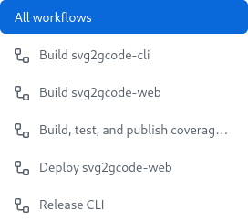
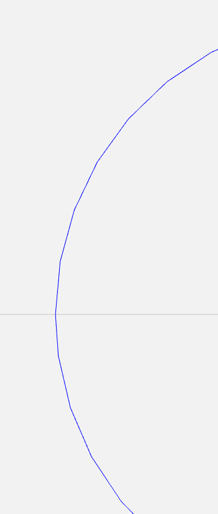

+++
title = "svg2gcode Progress Update"
date = 2021-09-09T16:00:47-07:00
description = "A review of major changes and what's next"
[taxonomies]
tags = ["g-code", "svg"]
+++

[svg2gcode](https://github.com/sameer/svg2gcode) is a tool for converting vector graphics to [G-Code](https://en.wikipedia.org/wiki/G-code): a language widely used for [numerically controlled](https://en.wikipedia.org/wiki/Numerical_control) machines like pen plotters.


*Example vector graphic*


*A pen plotter attachment is used to draw the SVG on a 3D printer*

Quoting Thomas Kole [on Twitter](https://twitter.com/ThomasKoleTA/status/1422637394562531329):

> It's written in rust and was super easy to compile for the [Raspberry] Pi. I first tried a python implementation, but this is orders of magnitude faster. It's crazy fast.

I initially released svg2gcode in 2019 as part of a project to [build a pen plotter](/blog/pen-plotter).
The Inkscape extension we tried to use for that was overly complicated so I set out to build a standalone tool from scratch.
The project has changed considerably since then -- there are several noteworthy features which I'll discuss below.

## Removing barriers to use

After talking to a few users over email, I realized that there were significant barriers preventing wider use of svg2gcode:

- Rust is still relatively niche and not many people have the [build tools](https://www.rust-lang.org/learn/get-started) installed (yet! :crab:)
- Software developers are familiar with [Git](https://git-scm.com/), but the potential user demographic for the tool is much broader
- While powerful, command line interface (CLI) tools can be difficult to use for those more comfortable with graphical applications

### Web interface

I created a [web app for svg2gcode](https://sameer.github.io/svg2gcode) to address these challenges:


The web interface is functionally equivalent to the CLI tool. There are some added ergonomics like saving settings to [Web Storage](https://developer.mozilla.org/en-US/docs/Web/API/Web_Storage_API) and on-the-fly validation:



It is written purely in Rust with the [Yew framework](https://yew.rs). The code is compiled to [WebAssembly](https://en.wikipedia.org/wiki/WebAssembly) using [Trunk](https://trunkrs.dev/), a web application bundler. The UI uses [Spectre.css](https://picturepan2.github.io/spectre/). This allowed me to make it:

- Fast :runner:: WebAssembly runs at near native speeds
- Secure :lock:: user information never leaves the browser
- Serverless : page assets are static and loaded once
- Free to use :money_with_wings:: no hosting costs, but [sponsorships](https://github.com/sponsors/sameer)  are appreciated :slightly_smiling_face:

Continuous deployment is done using [GitHub Actions](https://github.com/features/actions). Pushing a commit triggers workflow jobs to build, test, and publish the latest changes to [GitHub Pages](https://pages.github.com/):



### Prebuilt binaries

For those comfortable with the CLI but not too familiar with Rust, I set up [prebuilt binary downloads](https://github.com/sameer/svg2gcode/releases/). The [Rust Release Binary action](https://github.com/marketplace/actions/rust-release-binary) publishes binaries for platforms with x86-64 processors running Linux, Windows or OS X.

## Custom G-Code Sequences

Users can now specify a G-Code sequence to run at the beginning/end of a program and when the tool is turned on/off. This makes it possible to target just about any machine that accepts G-Code.

Enabling this involved a pretty comprehensive overhaul of how the tool handles G-Code. Most of the logic was pulled out into the [g-code crate](https://github.com/sameer/g-code): an all-in-one library for parsing, formatting, and outputting G-Code.

Each sequence is parsed into a [tokenized](https://en.wikipedia.org/wiki/Lexical_analysis#Tokenization) representation. If this fails, the tool stops early and an error message is displayed using [codespan](https://github.com/brendanzab/codespan):

```
error: could not parse gcode
  ┌─ begin_sequence:1:27
  │
1 │ G0 X0 Y0 (unclosed comment
  │                           ^ expected closing parenthesis
```

These tokens are inserted into the output where appropriate. For instance, the tool on/off sequences are inserted at the start/end of each path segment:

```
> svg2gcode --on '(tool on)' --off '(tool off)' examparse, format, and emitples/Vanderbilt_Commodores_logo.svg

G0 X59.02125187621354 Y114.1597945756128(tool on)
G1 X44.163311191869035 Y73.15496298711147 F300
...
G1 X59.02125187621354 Y114.1597945756128 F300;svg > g > g > path
(tool off)
```

## Circular Interpolation

When converting to G-Code, the tool must do something called curve flattening: curves are converted into a series of connected line segments within a given tolerance. The tolerance is kept small enough that there is no discernible difference between the original and flattened curves in the end product.
We can see the difference close up using a [G-Code viewer](https://ncviewer.com/):



*A close-up visualization of the G-Code for this circle reveals the line segments*

While flattening to line segments works well, some machines also support circular arc segments: given start/end points and a radius, the machine interpolates along a circular arc between the two.
Circular arc segments are much better at approximating curves. Output file size is decreased by a lot and the machine can better control velocity and acceleration while executing the program.

I implemented circular interpolation following Kaewsaiha & Dejdumrong's paper [Modeling of Bézier Curves Using a Combination of Linear and Circular Arc Approximations](https://sci-hub.st/https://doi.org/10.1109/CGIV.2012.20).


*A truer approximation with circular interpolation enabled*

Aside from that I ironed out some bugs with the logic for geometric transformations on elliptical arcs. Vitaly Putzin's [svgpath](https://github.com/fontello/svgpath) was a really good reference for this.

## What's next?

I have a whole laundry list of ideas to take svg2gcode even further. To name a few:

Features:

* Support [shape fills](https://github.com/sameer/svg2gcode/issues/15) for engraving/milling
* [Minimize travel time](https://github.com/sameer/svg2gcode/issues/13) for faster processing
* Support [NURBS curve](https://en.wikipedia.org/wiki/Non-uniform_rational_B-spline) interpolation
* G-Code syntax highlighting in settings for the web interface
* Add an output preview panel to the web interface
* Support selecting an SVG by URL (more mobile-friendly)

Builds and packaging:
* Publish CLI packages for major Linux distributions, Homebrew on OS X, and Chocolatey on Windows
* Release prebuilt binaries for ARM architectures

New platforms:
* Desktop app
* [Progressive web app](https://developer.mozilla.org/en-US/docs/Web/Progressive_web_apps) for mobile
* Plugins for [Inkscape](https://inkscape.org/), [Octoprint](https://octoprint.org/) and other popular tools

But I only have so much time! :sweat_smile:

If you have questions or want to contribute, check out [svg2gcode on GitHub](https://github.com/sameer/svg2gcode/). If you liked using svg2gcode or want to bounce ideas off me, [let's chat](/about#social)!
