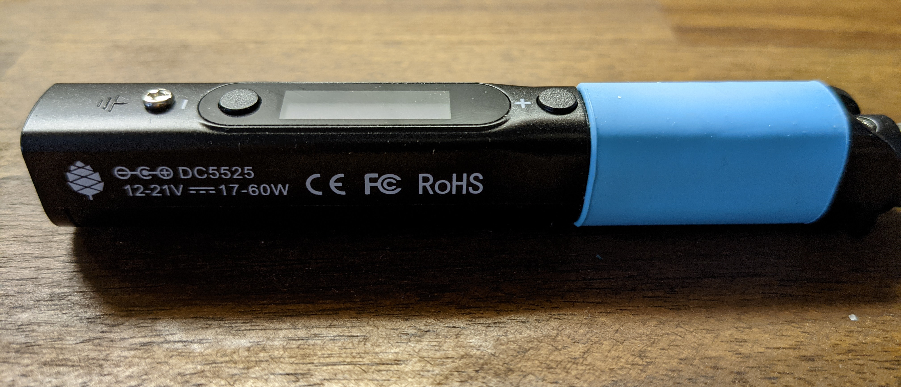
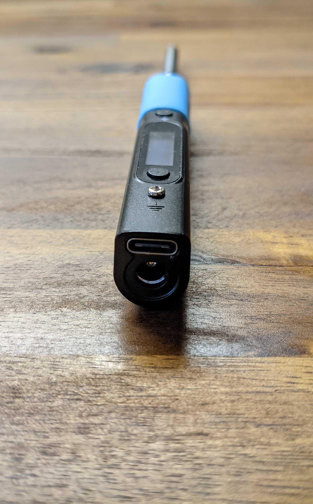

+++
title = "The Pinecil: a portable USB-C soldering iron"
date = 2021-08-01T15:36:42-04:00
description = "My thoughts on the Pinecil: a portable USB-C soldering iron."
[taxonomies]
tags = ["hardware"]
+++

I finally received my [Pinecil soldering iron](https://pine64.com/product/pinecil-smart-mini-portable-soldering-iron/) last week.
It's a really good product so I thought it was worth writing about.

## Description

The Pinecil is a portable soldering iron powered by DC barrel jack or USB-C.
Tip temperature can be accurately controlled after some calibration.
The tips have integrated heating elements and are easy to swap.
Some sort of [IMU](https://en.wikipedia.org/wiki/Inertial_measurement_unit) controls screen orientation and ensures safety with automatic snooze + shutdown.

The Pinecil is heavily inspired by the TS100 which was around [even back in 2017](https://hackaday.com/2017/07/24/review-ts100-soldering-iron/):

*Jenny List from Hackaday*

### Comparison

I've compared the Pinecil with other portable irons below:

||Hakko FX-901|TS100|TS80P|Pinecil|
|--|--|--|--|--|
|Power supply|4 AA Batteries|barrel jack|USB-C / barrel jack|USB-C / barrel jack|
|Power output (max)|6W|65W (theoretical)|18W|60W|
|Temperature control|:x:|:heavy_check_mark:|:heavy_check_mark:|:heavy_check_mark:|
|Motion sensor|:x:|:heavy_check_mark:|:heavy_check_mark:|:heavy_check_mark:|
|Swappable tip|:heavy_check_mark:|:heavy_check_mark:|:heavy_check_mark:|:heavy_check_mark:|
|Microcontroller|N/A|STM32 (ARM)|STM32 (ARM)|GD32VF103TB (RISCV)|
|Open-source firmware|N/A|:ok: (FOSS alternative available)|:ok: (FOSS alternative available)|:heavy_check_mark:|
|PCB schematics|:x:|:x:|:x:|:heavy_check_mark:|
|PCB placement diagrams|:x:|:x:|:x:|:heavy_check_mark:|
|Price|$32.07|~ $70|$109.95|$24.99 (community price)|
|Picture|||||
|Link|[Hakko](https://www.hakko.com/english/products/hakko_fx901_spec.html)|[Amazon](https://www.amazon.com/s?k=ts100)|[Adafruit](https://www.adafruit.com/product/4244)|[Pine Store](https://pine64.com/product/pinecil-smart-mini-portable-soldering-iron/)|

## Shipping

Standard shipping on the Pine64 Store is $11.99 USD so I thought it might arrive quickly. Little did I know that it would take four months :upside_down_face:.

The tracking info showed that the package was redirected multiple times in Shenzhen. I was mildly concerned but chalked it up to a combination of COVID-19 conditions and increased shipping volume.
However, after three months, the tracking number expired and the last update was `2021-06-10 19:00 United States, overseas import cancellation`.
It probably got lost at customs.

I reached out to the Pine64 team and they were kind enough to send me a second one. To their credit, this package took only 20 days to arrive. The box was a bit roughed up but the Pinecil was perfectly fine.

## Review

### Getting Started

There are no instructions in the box nor any on the [Pinecil's store page](https://pine64.com/product/pinecil-smart-mini-portable-soldering-iron/) but I found the GitHub repo for [IronOS](https://github.com/Ralim/IronOS), the Pinecil's firmware.
Through that I discovered that there is a [Pinecil wiki page](https://wiki.pine64.org/wiki/Pinecil)... :facepalm:

The interface is simple enough ---  click plus to activate the iron, click minus to go into settings.

### Repair Job

With the setup out of the way, I used the Pinecil in repairing a really old record player. The PCB traces looked quite different from anything I've seen before:

I used my laptop's 60W USB-C charger to power the Pinecil. It heats up *really fast*. The tip conducts well and the solder melts quickly. There is some oscillation around the target temperature, but it stabilizes after a bit.

The only issue I had was some awkwardness with safely positioning the iron when not in use.
The [mini stand](https://pine64.com/product/pinecil-portable-mini-stand/) provided a place to rest the Pinecil without damaging my table. However, I was worried the entire time about pulling on the cable and dropping the iron. I will probably design and 3D print a more secure mounted stand.

*Pine Store image of the portable mini stand*

## Closing thoughts

The biggest takeaway from my experience with the Pinecil was that USB-C is *the future*.
We finally have a standard, reversible connector for delivering power, transferring data, and other auxiliary functions.
USB-C was first adopted in smartphones, then laptops, and only recently in select small footprint electronics like single-board computers.
Continuing this trend, I expect more traditional devices to be USB-C enabled very soon.
Imagine a power drill with USB-C connectivity: you would have the freedom to power it from the grid, a battery pack of your choice, or even your phone.

It goes without saying that the Pine64 team and community have created an impressive product.
Rough edges aside, it is the best portable soldering iron that I've seen.
The Pinecil's PCB designs, schematics, and firmware are all openly available.
The iron is extensible, easy to repair, and backed by a large community.
I'm really looking forward to see what Pine64 releases next!
